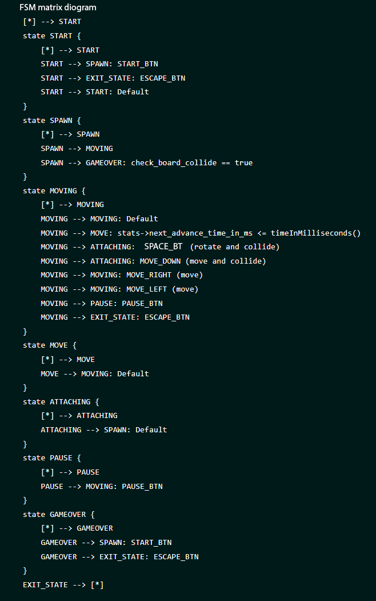

# Тетрис
В данном проекте реализовна игра «Тетрис» на языке программирования "С" с использованием структурного подхода.
Для формализации логики игры использован конечный автомат.
### Конечные автоматы

Конечный автомат (КА) в теории алгоритмов — математическая абстракция, модель дискретного устройства, имеющего один вход, один выход и в каждый момент времени находящегося в одном состоянии из множества возможных.

При работе КА на вход последовательно поступают входные воздействия, а на выходе КА формирует выходные сигналы. Переход из одного внутреннего состояния КА в другое может происходить не только от внешнего воздействия, но и самопроизвольно.

### Тетрис

Реализованный КА состоит из следующих состояний:

- Старт — состояние, в котором игра ждет, пока игрок нажмет кнопку готовности к игре.
- Спавн — состояние, в которое переходит игра при создании очередного блока и выбора следующего блока для спавна.
- Перемещение — основное игровое состояние с обработкой ввода от пользователя: поворот блоков/перемещение блоков по горизонтали.
- Сдвиг — состояние, в которое переходит игра после истечения таймера. В нем текущий блок перемещается вниз на один уровень.
- Соединение — состояние, в которое переходит игра после «соприкосновения» текущего блока с уже упавшими или с землей. Если образуются заполненные линии, то она уничтожается, и остальные блоки смещаются вниз. Если блок останавливается в самом верхнем ряду, то игра переходит в состояние «игра окончена».
- Игра окончена — игра окончена.

 Программа состоит из двух частей: библиотеки, реализующей логику игры тетрис, и терминального интерфейса с использованием библиотеки `ncurses`.

  Сборка программы  настроена с помощью Makefile со стандартным набором целей для GNU-программ: all, install, uninstall, clean, dvi, dist, test, gcov_report.  
 Программа разработана в соответствии с принципами структурного программирования.
 
Обеспечено покрытие библиотеки unit-тестами с помощью библиотеки `check` .  Покрытие библиотеки с логикой игры тестами составляет более 80 процентов. 

 <b>В игре реализованы следующие механики:</b>
  - Вращение фигур;
  - Перемещение фигуры по горизонтали;
  - Ускорение падения фигуры (при нажатии кнопки фигура перемещается до конца вниз);
  - Показ следующей фигуры;
  - Уничтожение заполненных линий;
  - Завершение игры при достижении верхней границы игрового поля;
  - Начало игры,
  - Пауза,
  - Завершение игры,
  - Стрелка влево — движение фигуры влево,
  - Стрелка вправо — движение фигуры вправо,
  - Стрелка вниз — падение фигуры,
  - Стрелка вверх — не используется в данной игре,
  - Действие (вращение фигуры).
  - подсчет очков;
  - хранение максимального количества очков в отедельном файле.  
  
 Игровое поле соответствует размерам: десять «пикселей» в ширину и двадцать «пикселей» в высоту.
 Фигура после достижения нижней границы поля или соприкосновения с другой фигурой остановается. Вслед за этим происходит генерация следующей фигуры.
Диаграмма, описывающая используемый КА (его состояния и все возможные переходы).

Начисление очков происходить следующим образом:

- 1 линия — 100 очков;
- 2 линии — 300 очков;
- 3 линии — 700 очков;
- 4 линии — 1500 очков.

Также в игре присутсвует механика уровней. Каждый раз, когда игрок набирает 600 очков, уровень увеличивается на 1.  
Повышение уровня увеличивает скорость движения фигур. Максимальное количество уровней — 10.
